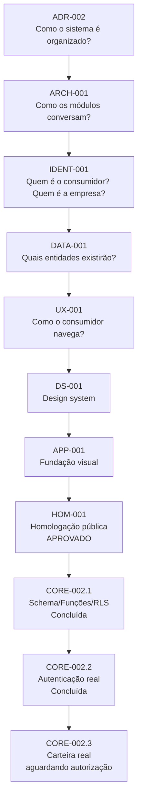

# Bright Multi Plataforma — Roadmap

Sequência oficial de fases, passadas e futuras. Complementa `PROJECT-CHECKLIST.md` (que lista o que já foi entregue, com detalhe por relatório) com a visão de **ordem e dependência entre fases**. Atualizado a cada nova decisão de sequenciamento da Direção.

## Status do projeto

| Status | Data início | Data final | Código | Fase | Commit | Situação |
|---|---|---|---|---|---|---|
| ✅ | 28/07/2026 | 28/07/2026 | BE-001 | Fundação da Plataforma | `7f0cb81` | Concluída |
| ✅ | 29/07/2026 | 29/07/2026 | SUP-003 | Fundação do Banco | `3182c78` | Concluída |
| ✅ | 30/07/2026 | 30/07/2026 | AUTH-001 | Autenticação | `a6decaf` | Concluída |
| ✅ | 30/07/2026 | 30/07/2026 | AUTH-002 | Validação da Autenticação | `226730e` | Concluída |
| ✅ | 30/07/2026 | 30/07/2026 | PERM-001 | Permissões | `22a6f6f` | Concluída |
| ✅ | 30/07/2026 | 30/07/2026 | CORE-001 | Área Autenticada | `8d39c71` | Concluída |
| ✅ | 31/07/2026 | 31/07/2026 | DEV-001 | Infraestrutura de Deploy | `36b043c` | Concluída |
| ✅ | 31/07/2026 | 31/07/2026 | PRODUCT-001 | Constituição do Produto | `9e3d73e` | Concluída |
| ✅ | 31/07/2026 | 31/07/2026 | PRODUCT-002 | Auditoria Técnica | — (não commitada isoladamente; ver `docs/reports/`) | Concluída |
| ✅ | 01/08/2026 | 01/08/2026 | ADR-002 | Padronização Arquitetural | `e9cbd67` | Concluída |
| ✅ | 01/08/2026 | 01/08/2026 | ARCH-001 | Arquitetura Completa | `9fbae05` | Concluída |
| ✅ | 01/08/2026 | 01/08/2026 | IDENT-001 | Modelo de Identidade | `8461039` | Concluída |
| ✅ | 01/08/2026 | 01/08/2026 | DATA-001 | Modelo Conceitual de Dados | `af83667` | Concluída |
| ✅ | 01/08/2026 | 01/08/2026 | UX-001 | Arquitetura da Experiência | `318339c` | Concluída |
| ✅ | 01/08/2026 | 01/08/2026 | DS-001 | Design System | `972fb27` | Concluída |
| ✅ | 01/08/2026 | 02/08/2026 | APP-001 | Fundação Visual do Aplicativo do Consumidor | `680918a` | Concluída |
| ✅ | 01/08/2026 | 02/08/2026 | HOM-001 | Homologação do Aplicativo do Consumidor | `e59097a` | Concluída — **Gate: APROVADO** |
| ➖ | — | — | QA-001 | Estabilização Pós-Homologação | — | **Não executada** — nenhum defeito impeditivo encontrado em `HOM-001` |
| ✅ | 02/08/2026 | 05/08/2026 | CORE-002.1 | Schema, Funções e RLS (Conta Fidelidade / Lançamentos) | `e0b8889` | Concluída — 8 migrations aplicadas ao Supabase real, 24/24 testes aprovados (`docs/reports/CORE-002.1-Relatorio.md`) |
| ✅ | 05/08/2026 | 05/08/2026 | CORE-002.2 | Autenticação Real do Consumidor | — | Concluída — 18/18 critérios de aceite aprovados (`docs/reports/CORE-002.2-Relatorio.md`) |
| 🔄 | — | — | CORE-002.3 | Conta Fidelidade, Carteira e Lançamentos Reais | — | Aguardando confirmação da Direção sobre o relatório de CORE-002.2 |

## Por que esta ordem

Cada fase depende do resultado da anterior — construir fora de ordem gera risco de retrabalho (decisão registrada pela Direção após `PRODUCT-002` revelar dependências estruturais não conhecidas antes):

`QA-001` não foi executada — gate aprovado sem ajustes obrigatórios (ver notas abaixo).

## Notas

- `PRODUCT-002` não gerou um commit próprio isolado — foi uma auditoria técnica (`docs/reports/PRODUCT-002-Relatorio-de-Auditoria-Tecnica.md`), commitada junto com a correção de `ADR-002` (`e9cbd67`).
- `SUP-003` está listada aqui como marco de fundação do banco; as fases `SEC-001`, `DB-001`, `SUP-001`, `SUP-002`, `SEC-003` (fundação, dependências, conexão inicial, rotação de credenciais) antecedem `SUP-003` e estão detalhadas em `PROJECT-CHECKLIST.md`.
- Este roadmap reflete apenas a **sequência**; detalhe de escopo/entrega de cada fase concluída está nos relatórios em `docs/reports/`.
- `IDENT-001` produziu `docs/architecture/IDENT-001-Modelo-de-Identidade.md` — identidade única, Conta Fidelidade (entidade central), relacionamento N:N, Fluxo Oficial do Consumidor v1 e Matriz Oficial de RLS, todos **congelados** (§11 do documento) — mudança futura exige ADR.
- `DATA-001` produziu `docs/architecture/DATA-001-Modelo-Conceitual-de-Dados.md` — catálogo de 15 entidades, cada uma com estado (quem cria/altera/consulta/administra/consome), origem da informação, eventos de ciclo de vida e dependências — ancoradas na Conta Fidelidade, sem SQL, sem migrations.
- `UX-001` produziu `docs/architecture/UX-001-Arquitetura-da-Experiencia.md` — mapa de navegação (12 telas), princípio de UX emocional, Central de Notificações/Novidades separadas, selo "Em breve" na tela Jogar.
- `DS-001` produziu `docs/architecture/DS-001-Design-System.md` — paleta oficial, tipografia oficial (Inter), Mobile First confirmado, regra formal de quatro momentos especiais de animação e catálogo conceitual de 16 componentes, todos congelados — sem código React ainda.
- `APP-001` produziu a primeira versão pública em código do Aplicativo do Consumidor (`docs/BE-009-Fundacao-Visual-do-Aplicativo-do-Consumidor.md`) — 12 telas de `UX-001` + 1 rota técnica de redirecionamento (13 rotas Next.js no total, contagem congelada em `docs/reports/APP-001-Relatorio.md §2`), os 16 componentes de `DS-001`, dados 100% mockados, sem autenticação real, sem conexão com banco. Corrigido um bloqueio real: o middleware de autenticação da Retaguarda (`src/proxy.ts`) redirecionava `/cliente/*` para `/login` — agora tratado como caminho público, já que a identidade do consumidor é um domínio separado (`IDENT-001`). **Status: implementação concluída — homologação pública pendente (`HOM-001`), decisão da Direção que a validação local (lint/build/HTTP) não substitui a revisão visual publicada.**
- `HOM-001` (concluída, `docs/reports/HOM-001-Relatorio.md`): repositório `BrightEcosystem/Bright-Platform` tornado público e conectado ao projeto Vercel `bright-ecosystem/web`. Deploy de produção realizado. Uma falha crítica encontrada (tema claro de `DS-001` não aplicado em produção) foi corrigida e reverificada na mesma execução (`e59097a`). Todas as 13 rotas validadas mobile/desktop na URL pública; regressão da Retaguarda confirmada sem impacto; fluxo de login e navegação confirmados por clique/digitação reais. **Gate: APROVADO pela Direção, sem ressalvas.**
- `QA-001`: **não executada** — a Direção confirmou que nenhum defeito impeditivo foi encontrado em `HOM-001`. Permanece no roadmap como fase condicional para entregas futuras.
- `CORE-002` (programa em andamento, dividido em sub-fases): objetivo geral — transformar o Aplicativo do Consumidor de prova de conceito mockada em aplicação integrada ao Core: autenticação real do consumidor, Conta Fidelidade real (`IDENT-001`), dados reais do Supabase, carteira/saldo/cashback reais, remoção gradual dos mocks. **Fora de escopo em todo o programa:** roleta, raspadinha, baús, missões, ranking, XP como mecânica, campanhas automáticas, notificações, marketplace operacional — permanecem desacoplados até a base de identidade e carteira estar operacional. Não pode alterar a arquitetura já congelada sem ADR.
- `CORE-002.1` (concluída, `docs/reports/CORE-002.1-Relatorio.md`): plano técnico v0.3.0 (`docs/architecture/CORE-002-Plano-Tecnico.md`) incorporando os 14 ajustes obrigatórios da revisão v0.2.0 mais as decisões finais da Direção (permissões mapeadas, estado `closed` com `closed_at`/`closed_reason`, idempotência única por tenant, precisão por `asset_type`, `criar_lancamento` reforçada). 8 migrations aplicadas ao Supabase real: 2 tabelas (`contas_fidelidade`, `lancamentos`), 5 funções `security definer`, RLS completa (4 políticas de `SELECT`, nenhuma de escrita direta), extensão do catálogo de permissões. Matriz de 24 testes obrigatórios executada com dados fictícios reais (usuários via Admin API, sessão simulada) — **24/24 aprovados**, após 2 correções aplicadas na própria execução: `REVOKE EXECUTE`/privilégios de tabela não bloqueavam `anon`/`authenticated` por padrão neste projeto Supabase (mecanismo de `alter default privileges`), e a checagem de saldo suficiente bloqueava incorretamente estornos. Nenhuma alteração em tabela existente do Core, nenhum arquivo de código-fonte alterado. Dados fictícios 100% removidos e confirmados por consulta.
- `CORE-002.2` (concluída, `docs/reports/CORE-002.2-Relatorio.md`): autenticação simulada (`localStorage`) substituída por Supabase Auth real — login, logout, sessão persistente, recuperação/redefinição de senha, cadastro, proteção de rotas no servidor (`src/proxy.ts`, `auth.getUser()`, não mais no client). 2 rotas técnicas novas (`/cliente/esqueci-senha`, `/cliente/redefinir-senha`), fora do mapa de 12 telas congelado de `UX-001`. **18/18 critérios de aceite aprovados**, incluindo confirmação de que a identidade única permite a mesma sessão acessar Retaguarda e Aplicativo do Consumidor sem loop. Nenhuma migration criada, nenhum mock financeiro alterado, nenhuma alteração em RLS/funções de `CORE-002.1`. Dados fictícios 100% removidos.
- `CORE-002.3` — Conta Fidelidade, Carteira e Lançamentos Reais: **aguardando confirmação da Direção sobre o relatório de `CORE-002.2`** antes de iniciar.
