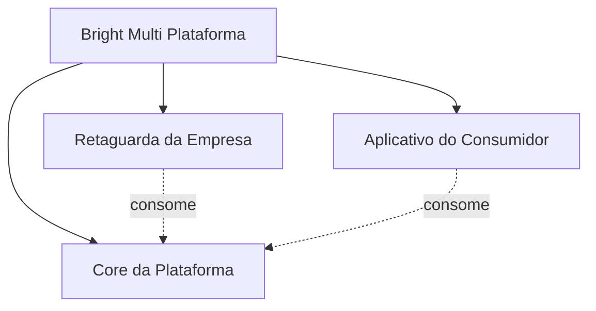
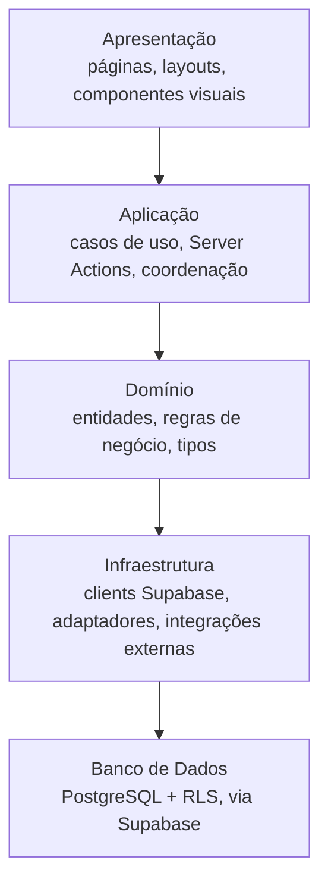
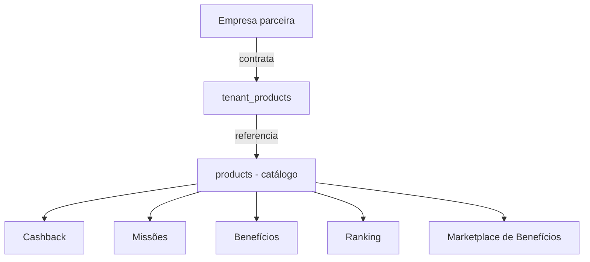

# ARCH-001 — Arquitetura Completa da Bright Multi Plataforma

**Status:** Rascunho para revisão da Direção
**Versão:** 0.1.0
**Documentos relacionados:** `ADR-002-Arquitetura-do-Ecossistema-Bright.md`, `BE-001` a `BE-008`, `docs/product/` (Constituição do produto)

---

## 1. Objetivo

Congelar a arquitetura da Bright Multi Plataforma antes de `IDENT-001`, `DATA-001`, `UX-001`, `DS-001` e `APP-001` — de forma que qualquer desenvolvedor consiga identificar onde implementar uma funcionalidade, qual camada usar, quais dependências são permitidas, e como novos módulos serão adicionados sem reestruturação. Nenhum código foi escrito ou alterado nesta fase.

Esta é uma consolidação, não uma redefinição: onde algo já estava decidido (`ADR-002`, `BE-001`–`BE-008`), este documento referencia e detalha — não substitui.

## 2. Arquitetura geral

| Camada | Responsabilidade | Quem usa |
|---|---|---|
| **Core da Plataforma** | Infraestrutura compartilhada: autenticação, usuários, permissões, multiempresa, produtos contratados, auditoria, integrações-base, configurações globais. Nenhuma regra de negócio de fidelidade/gamificação vive aqui. | Nenhum usuário final diretamente — é consumido pelas outras duas camadas. |
| **Retaguarda da Empresa** | Experiência operacional da empresa parceira: dashboard, clientes, campanhas, pontuação, cashback, benefícios, comprovantes, relatórios, configurações. | Empresa parceira e administrador. |
| **Aplicativo do Consumidor** | Experiência do cliente final: início, carteira, missões, jogar (roleta/raspadinha/baú), benefícios, ranking, perfil, indicação, comprovantes. | Consumidor final. |

Regra estrutural (`ADR-002`): Retaguarda e Aplicativo **nunca se comunicam diretamente entre si** — qualquer dado que um precise do outro passa pelo Core. Nenhuma das duas duplica autenticação, multiempresa, permissões ou auditoria.

## 3. Arquitetura por camadas técnicas

Esta é a mesma arquitetura em camadas já definida em `BE-002 §2`, com a camada de banco explicitada:

Esta pilha se repete **dentro de cada camada geral** (Core, Retaguarda, Aplicativo) — não é uma pilha única compartilhada fisicamente, é o mesmo padrão de organização de código aplicado em cada uma. Ex.: uma página da Retaguarda (`Apresentação`) chama uma Server Action (`Aplicação`), que aplica uma regra de domínio (`Domínio`), que usa um client Supabase (`Infraestrutura`) para consultar o Postgres com RLS (`Banco de Dados`) — mesmo fluxo já em produção desde `AUTH-001`/`CORE-001`, documentado em `BE-002 §7–8`.

## 4. Core da Plataforma

| Capacidade | Estado atual | Onde vive no código |
|---|---|---|
| Autenticação | Implementada (`AUTH-001`, `AUTH-002`) | `src/lib/auth/session.ts`, `src/services/auth/`, `src/proxy.ts` |
| Usuários | Implementado (`profiles`) | `src/modules/profile/`, migration `0003` |
| Permissões | Implementado (15 permissões, 4 papéis, `PERM-001`) | `src/lib/auth/permissions.ts`, `src/modules/auth/permission-catalog.ts`, migrations `0004`, `0009`, `0010` |
| Multiempresa | Implementado (`tenants`, `tenant_memberships`, RLS) | migrations `0002`, `0003`, `0007` |
| Produtos contratados | Implementado (`products`, `tenant_products`) | migration `0005` |
| Auditoria | Tabela existe (`audit_logs`), **nenhuma automação grava eventos ainda** (pendência já registrada em `PERM-001`/`CORE-001`) | migration `0006` |
| Integrações-base | Não implementado — apenas `src/modules/integrations/` reservado, sem conteúdo | — |
| Configurações globais | Parcial — `/configuracoes` (Retaguarda) já lê permissões do Core; nenhuma configuração verdadeiramente global (fora de tenant) implementada | `src/app/(platform)/configuracoes/` |

O Core é a única camada com RLS habilitada e testada (10/10 tabelas, `CORE-001 §11`). Nenhuma tabela nova foi criada por esta fase.

## 5. Retaguarda da Empresa

**Já existe uma fundação real** — construída em `CORE-001` sob o nome (então corrente) de "área autenticada da Bright Platform". Mapeamento direto:

| Item do escopo desta fase | Estado | Rota atual |
|---|---|---|
| Dashboard | Implementado (dados institucionais reais) | `/dashboard` |
| Clientes | **Não implementado.** Existe uma rota placeholder antiga (`/clientes`, pré-`CORE-001`, "Em construção") que pode ser reaproveitada quando esta funcionalidade for desenhada — não confundir com "Usuários" (gestão de membros administrativos da empresa, já implementada em `/usuarios`) | `/clientes` (placeholder) |
| Campanhas | Não implementado | — |
| Pontuação | Não implementado (depende de `DATA-001`/`IDENT-001`) | — |
| Cashback | Não implementado (idem) | — |
| Benefícios | Não implementado | — |
| Comprovantes | Não implementado (depende de OCR, `070-Integracoes.md`) | — |
| Relatórios | Não implementado | — |
| Configurações | Implementado (seções institucionais condicionadas por permissão) | `/configuracoes` |

Adicionalmente já implementado nesta camada, fora da lista desta fase mas parte da mesma experiência: `/minha-conta` (perfil do usuário administrativo), `/empresa` (dados da empresa, somente leitura).

**Observação de limpeza (não executada nesta fase — fora de escopo, sem alteração de código):** as rotas placeholder `empresas`, `agentes-ia`, `workflows`, `integracoes`, `licitacoes`, `financeiro`, `analytics` (criadas na fundação original, antes de `ADR-002` restringir o escopo do projeto) não correspondem a nenhum item da Retaguarda da Empresa definida agora. Ficam candidatas a remoção em uma fase futura de código — não fazem mal permanecendo, mas não devem servir de referência para onde implementar algo novo.

## 6. Aplicativo do Consumidor

Nenhuma linha de código existe ainda para esta camada — é inteiramente conceitual, definida em `docs/product/`:

| Item do escopo desta fase | Documento de origem |
|---|---|
| Início | `docs/product/030-Jornadas.md §1` (esboço de tela em conversa anterior, não código) |
| Carteira | `040-Economia.md`, `050-Gamificacao.md §1` |
| Missões | `050-Gamificacao.md §3` |
| Jogar (roleta, raspadinha, baú) | `050-Gamificacao.md §7–10` |
| Benefícios | `070-Integracoes.md §4` (Marketplace de Benefícios) |
| Ranking | `050-Gamificacao.md §4` |
| Perfil | Não detalhado ainda em `docs/product/` — equivalente ao "Minha Conta" da Retaguarda, mas para o consumidor |
| Indicação | Mencionado em `030-Jornadas.md`/roadmap, sem mecânica detalhada ainda |
| Comprovantes | `070-Integracoes.md §1–2` |

Esta camada depende diretamente de `IDENT-001` (identidade do consumidor) e `DATA-001` (modelo de dados) antes de qualquer implementação — por isso a ordem de fases definida pela Direção (`ARCH-001` → `IDENT-001` → `DATA-001` → `UX-001` → `DS-001` → `APP-001`).

## 7. Comunicação entre módulos

```mermaid
graph LR
    subgraph Retaguarda["Retaguarda da Empresa"]
        R1[Dashboard]
        R2[Clientes]
        R3[Campanhas]
        R4[Pontuação/Cashback]
    end

    subgraph Core["Core da Plataforma"]
        C1[Autenticação]
        C2[Multiempresa]
        C3[Permissões]
        C4[Produtos contratados]
        C5[Auditoria]
    end

    subgraph Aplicativo["Aplicativo do Consumidor"]
        A1[Carteira]
        A2[Missões]
        A3[Jogar]
        A4[Benefícios]
    end

    Retaguarda -->|lê/escreve via Server Actions| Core
    Aplicativo -->|lê/escreve via API| Core
    Retaguarda -.-x|proibido: chamada direta| Aplicativo
    Aplicativo -.-x|proibido: chamada direta| Retaguarda
```

**Dependências permitidas:**
- Retaguarda → Core (sempre).
- Aplicativo → Core (sempre).
- Dentro de uma mesma camada, um módulo pode depender de outro do mesmo nível (ex.: Missões depende de Pontuação, ambos no Aplicativo) — desde que a dependência não vaze para fora da camada.

**Dependências proibidas:**
- Retaguarda ↔ Aplicativo diretamente (qualquer dado compartilhado passa pelo Core — ex.: a Retaguarda cadastra um benefício; o Aplicativo o lê através de uma consulta ao Core, nunca por uma chamada direta ao módulo de Benefícios da Retaguarda).
- Qualquer camada acessando o banco diretamente sem passar pela Infraestrutura (`BE-002 §8`: página/componente → serviço → repositório → adaptador → Supabase).
- Core dependendo de Retaguarda ou Aplicativo (inversão de dependência — o Core nunca conhece regra específica de fidelidade/gamificação, `BE-002 §3`).

## 8. Modularização por contratação

A plataforma **já implementa** o mecanismo de contratação modular — não é uma funcionalidade nova, é o par `products`/`tenant_products` (migration `0005`, em produção desde `SUP-003`).

Cada módulo de gamificação (Cashback, Missões, Benefícios, Ranking, Marketplace de Benefícios, e os demais de `050-Gamificacao.md`) se torna uma entrada no catálogo `products`, habilitável por empresa via `tenant_products` — o mesmo padrão que já habilita produtos hoje (`CORE-001`, dashboard mostra produtos habilitados por tenant). Nenhuma tabela nova é necessária só para o conceito de "contratar um módulo" — a estrutura já existe. O que falta (tratado em `DATA-001`) é o **conteúdo/dados de cada módulo em si** (ex.: uma linha em `tenant_products` diz que "Missões" está habilitado; as tabelas de missões, progresso, etc. são o que `DATA-001` vai desenhar).

**Princípio de independência:** cada módulo deve funcionar com os demais desabilitados — ex.: uma empresa pode habilitar só Cashback, sem Missões nem Ranking, e a experiência do consumidor deve degradar graciosamente (não mostrar seções de módulos não contratados), mesmo padrão já usado pela Retaguarda (`EmptyState`, permissão-a-permissão) em `CORE-001`.

## 9. Escalabilidade

**O que já está provado:**
- Isolamento multiempresa via RLS (Postgres) — testado com múltiplos tenants reais em `AUTH-002`/`PERM-001`/`CORE-001`, mecanismo padrão para milhares de empresas sem redesenho.
- Connection pooling via Supavisor (`DATABASE_URL`, modo transaction) — já configurado desde `SUP-001`, é o caminho padrão do Supabase para escalar conexões.
- Autorização granular (permissões por papel) já desacoplada de código — novas permissões são dado, não deploy (`RUN-004`).

**O que ainda não está provado e é risco real para "milhões de consumidores":**
- O modelo de identidade atual (`profiles`/`tenant_memberships`) foi desenhado para um número pequeno de usuários administrativos por empresa (colaboradores), não para uma base de consumidores em escala de massa. Este é exatamente o motivo de `IDENT-001` existir antes de `APP-001` — carga de milhões de linhas em `tenant_memberships`-like não foi modelada nem testada.
- Nenhum teste de carga foi feito em nenhuma fase até agora — todo o trabalho até aqui usou dados fictícios em volume mínimo (poucos tenants, poucos usuários por teste).
- O motor de IA (`060-IA.md`) e as mecânicas de sorteio com cálculo de probabilidade em tempo real (`050-Gamificacao.md §9-10`) têm requisitos de latência que ainda não foram dimensionados.

**Recomendação registrada, não decisão:** escalabilidade para "milhares de empresas, milhões de consumidores" deve ser validada com teste de carga real antes do lançamento comercial, não apenas presumida pela arquitetura em papel. Este documento descreve uma arquitetura *compatível* com esse crescimento (isolamento por tenant, camadas desacopladas, contratação modular sem redesenho de schema), não uma *garantia* de que ela já suporta esse volume sem ajustes — isso só se confirma com dado real, fora do escopo de uma fase puramente documental.

## 10. Consistência com a ADR-002

Checklist de verificação:

- [x] Três camadas (Core, Retaguarda, Aplicativo), nenhuma tratada como produto/repositório separado.
- [x] Nenhuma referência a Bright IA, Bright CRM, Bright Licitações ou produtos irmãos fora de escopo.
- [x] Identidade única mantida — nenhuma proposta de autenticação paralela para o consumidor.
- [x] `tenant_memberships` não é referenciado como vínculo final do consumidor em nenhuma seção deste documento.
- [x] Marketplace de Benefícios é o único marketplace mencionado.
- [x] Nenhum conflito entre Core, Retaguarda e Aplicativo identificado — as responsabilidades de cada camada (seção 2) não se sobrepõem.

## 11. Pendências e próximos passos

- `IDENT-001` — desenho técnico do vínculo do consumidor (não é `tenant_memberships`), ainda não iniciado.
- `DATA-001` — modelo conceitual das entidades da Retaguarda/Aplicativo (pontuação, cashback, missões, etc.), depende de `IDENT-001` estar definido primeiro.
- Integrações-base do Core (linha vazia na tabela da seção 4) — nenhum desenho ainda, não bloqueante para as fases imediatas.
- Auditoria automática (`audit_logs`) — pendência antiga, não resolvida por esta fase.
- Limpeza das rotas placeholder órfãs (seção 5) — não executada, fica como observação para uma fase futura de código.
