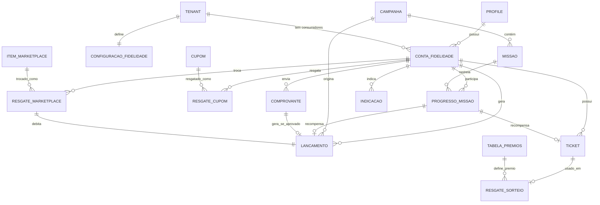

# DATA-001 — Modelo Conceitual de Dados da Bright Multi Plataforma

**Status:** Aprovado pela Direção
**Versão:** 0.2.0 — adiciona Estado das Entidades (§6), Origem da Informação (§7), Eventos por Entidade (§8) e Dependências entre Entidades (§9), a pedido da Direção; padroniza "Marketplace de Benefícios" em toda a documentação
**Documentos relacionados:** `IDENT-001-Modelo-de-Identidade.md` (Conta Fidelidade, Fluxo Oficial do Consumidor v1, Matriz Oficial de RLS — todos congelados, não redesenhados aqui), `ARCH-001-Arquitetura-Geral.md`, `docs/product/040-Economia.md`, `docs/product/050-Gamificacao.md`, `docs/product/070-Integracoes.md`

---

## 1. Objetivo

Definir o modelo conceitual de dados do domínio de fidelidade/gamificação da Bright Multi Plataforma — entidades, atributos, relacionamentos, responsabilidades e ciclo de vida — ancorado na **Conta Fidelidade**, já congelada em `IDENT-001`. Esta fase não escreve SQL, não cria migrations, não altera o banco. Atributos são descritos em nível conceitual (o que a entidade guarda), não como colunas tipadas — tipo exato, índice, constraint e nome físico de tabela são trabalho de implementação, fora deste documento.

As entidades já implementadas do Core (`tenants`, `profiles`, `tenant_memberships`, `roles`, `permissions`, `role_permissions`, `membership_roles`, `products`, `tenant_products`, `audit_logs` — `BE-003`) **não são redesenhadas aqui**. Este documento cobre exclusivamente o domínio novo: Conta Fidelidade e tudo que se conecta a ela.

## 2. Catálogo de entidades

### 2.1 Conta Fidelidade *(já congelada em `IDENT-001 §8`, recapitulada aqui como âncora)*

- **O que é:** relação entre um consumidor e uma empresa parceira; uma por par.
- **Atributos conceituais:** consumidor, empresa parceira, saldo de cashback, saldo de pontos, nível atual, XP acumulado, status (`active`/`suspended`/`removed`), data de criação.
- **Não guarda:** histórico linha a linha (isso é o Lançamento, §2.2), nem regra de negócio da mecânica (isso são os documentos de produto).

### 2.2 Lançamento (livro-razão)

- **O que é:** cada movimentação individual de uma Conta Fidelidade — o "porquê" de o saldo ter mudado. Implementa o ciclo `Pendente → Confirmado → Disponível → Resgatado/Expirado/Estornado` já descrito em `040-Economia.md §3`.
- **Atributos conceituais:** Conta Fidelidade à qual pertence, tipo (cashback ou ponto), valor, estado atual, origem (compra/campanha/missão/estorno/ajuste manual — sempre rastreável a uma causa), data de criação, data de expiração (quando aplicável), referência à transação de origem (se houver).
- **Relacionamentos:** N Lançamentos : 1 Conta Fidelidade. Um Lançamento pode referenciar outro (um Estorno referencia o Lançamento estornado — nunca edita o original).
- **Ciclo de vida:** o próprio ciclo de estados já congelado em `040-Economia.md §3`/`IDENT-001`. **Nunca editado após criado** (append-only) — um ajuste é sempre um novo Lançamento, nunca uma alteração do anterior (mesmo princípio de "nunca editar migration aplicada", aplicado a dado financeiro).
- **Responsabilidade:** é a fonte de verdade do saldo — o saldo em Conta Fidelidade é (na prática) uma soma cacheada dos Lançamentos `Disponível`/`Confirmado` daquela conta, recalculável a qualquer momento a partir do livro-razão.

### 2.3 Configuração de Fidelidade (por empresa parceira)

- **O que é:** os parâmetros que uma empresa parceira escolhe, dentro da faixa permitida pela Bright (`040-Economia.md §1`, `050-Gamificacao.md §1`).
- **Atributos conceituais:** empresa parceira, percentual de cashback (dentro da faixa permitida), prazo de validade padrão de pontos/cashback, teto de emissão por período.
- **Relacionamentos:** 1 Configuração de Fidelidade : 1 empresa parceira (a que já contratou o módulo via `tenant_products`).
- **Responsabilidade:** é consultada pelo Motor de Benefícios antes de qualquer emissão — nenhum Lançamento é criado fora da faixa aqui definida.

### 2.4 Campanha

- **O que é:** uma ação promocional com regras e orçamento próprios (ex.: "cashback em dobro esta semana"), criada pela empresa parceira ou pela Bright (cross-tenant, `040-Economia.md §2`).
- **Atributos conceituais:** empresa parceira (ou "Bright", se cross-tenant), nome, regra (ex.: multiplicador de cashback, XP em dobro), período de vigência, orçamento/teto, status (planejada/ativa/encerrada/pausada por teto atingido).
- **Relacionamentos:** 1 Campanha : N Lançamentos gerados sob sua regra (rastreabilidade de origem, §2.2). 1 Campanha : N Missões (quando a campanha usa missão como mecânica, §2.6).
- **Ciclo de vida:** Planejada → Ativa → Encerrada (por período ou por teto de orçamento atingido) → Arquivada.
- **Responsabilidade:** o Motor de Campanhas (`060-IA.md §7`) lê e atualiza esta entidade; nenhuma campanha gera Lançamento fora do próprio orçamento.

### 2.5 Ticket

- **O que é:** direito de participação em uma mecânica de sorteio (§2.7), conquistado por missão, nível ou campanha — nunca comprado (`050-Gamificacao.md §7`).
- **Atributos conceituais:** Conta Fidelidade titular, origem (qual missão/campanha/nível o gerou), tipo de mecânica ao qual dá direito (raspadinha/roleta/baú), status (disponível/usado/expirado).
- **Relacionamentos:** N Tickets : 1 Conta Fidelidade. 1 Ticket : 1 Resgate de Mecânica de Sorteio (quando usado, §2.8).
- **Ciclo de vida:** Disponível → Usado (gera um Resgate) ou Expirado.

### 2.6 Missão (definição) e Progresso de Missão

- **Missão (definição):** o que precisa ser feito, criada/ajustada pelo Motor de Missões (`060-IA.md §6`) ou pela empresa manualmente. Atributos conceituais: empresa parceira, descrição, critério de conclusão, prazo, recompensa (pontos/XP/Ticket/Cupom), campanha à qual pertence (se houver).
- **Progresso de Missão:** o estado de uma Conta Fidelidade específica em relação a uma Missão. Atributos conceituais: Conta Fidelidade, Missão, progresso atual (ex.: "2 de 3 compras"), status (em andamento/concluída/expirada).
- **Relacionamentos:** 1 Missão : N Progressos de Missão (um por Conta Fidelidade participante). Ao concluir, um Progresso de Missão gera um Lançamento (recompensa em pontos/cashback) e/ou um Ticket.

### 2.7 Tabela de Prêmios (mecânica de sorteio)

- **O que é:** a definição de uma mecânica de raspadinha/roleta/baú — os prêmios possíveis e suas probabilidades, auditável internamente (`050-Gamificacao.md §9`).
- **Atributos conceituais:** empresa parceira (ou catálogo padrão da Bright), tipo de mecânica, lista de prêmios possíveis (cada um com valor/tipo — pontos, cupom, ticket para outra mecânica — e probabilidade).
- **Relacionamento:** 1 Tabela de Prêmios : N Resgates de Mecânica de Sorteio (§2.8).
- **Dependência regulatória:** não pode ser usada em produção antes da liberação jurídica registrada em `080-Seguranca.md §4`/`docs/legal/` — esta é uma restrição de **processo**, não de dado; a entidade pode ser modelada agora, mas seu uso real depende dessa liberação (já registrado em `090-Roadmap.md §1`).

### 2.8 Resgate de Mecânica de Sorteio

- **O que é:** o evento de um consumidor usar um Ticket em uma Tabela de Prêmios e receber um resultado.
- **Atributos conceituais:** Ticket usado, Tabela de Prêmios, prêmio sorteado, data/hora, Lançamento ou Ticket gerado como prêmio (se aplicável).
- **Relacionamentos:** 1 Resgate : 1 Ticket : 1 Tabela de Prêmios.
- **Responsabilidade:** é o registro auditável de "o que saiu" — nunca recalculado depois (mesmo princípio de imutabilidade do Lançamento).

### 2.9 Cupom (definição) e Resgate de Cupom

- **Cupom (definição):** benefício com regra fixa, sem sorteio (`050-Gamificacao.md §11`). Atributos conceituais: empresa parceira, descrição, regra (ex.: "10% na próxima compra"), validade, origem (catálogo padrão, recompensa de missão, prêmio de sorteio).
- **Resgate de Cupom:** o uso de um cupom por uma Conta Fidelidade específica. Atributos conceituais: Conta Fidelidade, Cupom, data de resgate.
- **Relacionamentos:** 1 Cupom : N Resgates (um cupom pode ser usado por várias Contas Fidelidade, se for de catálogo geral) ou 1:1 (se foi um prêmio individual de sorteio/missão — depende da origem).

### 2.10 Indicação

- **O que é:** um consumidor indica outro para o programa de fidelidade de uma empresa (mencionado em `030-Jornadas.md`/`090-Roadmap.md`, mecânica não detalhada até agora — formalizada aqui pela primeira vez).
- **Atributos conceituais:** Conta Fidelidade indicadora, contato indicado (antes de ter conta — e-mail/telefone), Conta Fidelidade do indicado (preenchida quando ele se cadastra), status (enviada/aceita/expirada), recompensa ao indicador (Lançamento ou Ticket gerado quando a indicação é confirmada).
- **Relacionamentos:** 1 Conta Fidelidade (indicadora) : N Indicações. 1 Indicação : 0 ou 1 Conta Fidelidade (indicado — só existe depois que ele se cadastra).

### 2.11 Comprovante (OCR)

- **O que é:** o registro de upload de um comprovante de compra, quando não há integração direta de ponto de venda (`070-Integracoes.md §1-2`).
- **Atributos conceituais:** Conta Fidelidade que enviou, arquivo (referência de armazenamento), status de processamento (pendente/processado/rejeitado), dados extraídos pelo OCR (valor, data, estabelecimento), Lançamento gerado (se aprovado).
- **Relacionamentos:** 1 Comprovante : 0 ou 1 Lançamento (só gera lançamento se aprovado).
- **Responsabilidade:** nunca gera um Lançamento `Disponível` diretamente — sempre `Pendente` até confirmação (mesmo princípio de `040-Economia.md §3`).

### 2.12 Item de Marketplace de Benefícios e Resgate de Marketplace de Benefícios

- **Item de Marketplace de Benefícios:** um benefício de terceiro disponível para troca (`070-Integracoes.md §4`). Atributos conceituais: descrição, custo em pontos/cashback, parceiro fornecedor, estoque/disponibilidade.
- **Resgate de Marketplace de Benefícios:** o evento de uma Conta Fidelidade trocar saldo por um Item. Atributos conceituais: Conta Fidelidade, Item, Lançamento de débito gerado (saída de saldo).
- **Relacionamentos:** 1 Item : N Resgates. 1 Resgate : 1 Lançamento (débito).

### 2.13 Ranking — não é uma entidade armazenada

O Ranking (`050-Gamificacao.md §4`) é uma **visão derivada**, calculada a partir do XP das Contas Fidelidade de uma mesma empresa parceira (ou comunidade mais ampla, se essa decisão de escopo — ainda pendente, `docs/product/090-Roadmap.md §8` item 7 — for confirmada). Não é persistido como entidade própria nesta fase: a posição é sempre computada sob demanda (ou cacheada por performance, decisão de implementação, não de modelo).

## 3. Diagrama conceitual (relacionamentos)

## 4. Responsabilidades — resumo por camada

| Camada (`ARCH-001`) | Entidades que possui |
|---|---|
| **Core da Plataforma** | Nenhuma das entidades novas desta fase — apenas as já existentes (`tenants`, `profiles`, etc.) e a **Conta Fidelidade** (que tecnicamente vive no Core, `IDENT-001 §8.2`) |
| **Retaguarda da Empresa** | Configuração de Fidelidade, Campanha (criação/gestão), Missão (definição), Tabela de Prêmios (definição), Cupom (definição), Comprovante (validação manual quando aplicável) |
| **Aplicativo do Consumidor** | Lançamento (visualização — extrato), Ticket, Progresso de Missão, Resgate de Mecânica de Sorteio, Resgate de Cupom, Indicação, Comprovante (envio), Item/Resgate de Marketplace de Benefícios |

Nenhuma entidade é exclusiva de uma única tela — a tabela acima é sobre onde a entidade é **gerida** (criada/configurada) vs. onde é **consumida/vivida** pelo consumidor.

## 5. Ciclo de vida — visão consolidada

Todas as entidades de estado (Conta Fidelidade, Lançamento, Ticket, Progresso de Missão, Campanha, Comprovante, Indicação) seguem o mesmo princípio já estabelecido em `IDENT-001`/`040-Economia.md`: **criação automática por evento, nunca aprovação manual desnecessária; nunca exclusão física de dado financeiro; estados avançam para frente, correção é sempre um novo registro, nunca edição do antigo.**

## 6. Estado das Entidades — quem cria, altera, consulta, administra, consome

Insumo direto para a implementação futura da RLS (que implementará a Matriz Oficial de `IDENT-001 §7` por entidade).

| Entidade | Cria | Altera | Consulta | Administra | Consome |
|---|---|---|---|---|---|
| Conta Fidelidade | Sistema (automático, primeiro contato) | Sistema (saldo/nível); Colaborador (status) | Consumidor (própria); Colaborador (própria empresa); `platform.admin` (cross-tenant) | Colaborador administrativo | Aplicativo, Retaguarda |
| Lançamento | Sistema (Motor de Benefícios) | Ninguém — imutável | Consumidor (própria); Colaborador (resumo) | Ninguém | Aplicativo, Economia da Plataforma |
| Configuração de Fidelidade | Colaborador (ao contratar) | Colaborador (dentro da faixa) | Colaborador; Motor de Benefícios | Colaborador; Bright (define a faixa) | Motor de Benefícios, Retaguarda |
| Campanha | Colaborador; Bright (cross-tenant) | Colaborador; Motor de Campanhas (status automático) | Consumidor (ativas); Colaborador | Colaborador; Bright | Aplicativo, Motor de Campanhas |
| Ticket | Sistema (recompensa) | Sistema (status) | Consumidor (próprios) | Ninguém | Aplicativo (Jogar) |
| Missão (definição) | Colaborador; Motor de Missões | Colaborador; Motor de Missões | Consumidor (disponíveis); Colaborador | Colaborador | Aplicativo, Retaguarda |
| Progresso de Missão | Sistema | Sistema (a cada ação elegível) | Consumidor (próprio); Colaborador (agregado) | Ninguém | Aplicativo (Missões) |
| Tabela de Prêmios | Colaborador; catálogo Bright | Colaborador (sujeito à liberação jurídica) | Motor de Benefícios; auditoria | Colaborador; Bright | Aplicativo (indireto, via Resgate) |
| Resgate de Mecânica de Sorteio | Sistema (uso de Ticket) | Ninguém — imutável | Consumidor (próprio); auditoria | Ninguém | Aplicativo (Jogar) |
| Cupom (definição) | Colaborador; Sistema (prêmio) | Colaborador | Consumidor; Colaborador | Colaborador | Aplicativo (Benefícios), Retaguarda |
| Resgate de Cupom | Sistema | Ninguém — imutável | Consumidor (próprio); Colaborador (relatório) | Ninguém | Aplicativo |
| Indicação | Consumidor (indicador) | Sistema (status) | Consumidor indicador; Colaborador (agregado) | Ninguém | Aplicativo (Indicação) |
| Comprovante | Consumidor (upload) | OCR/Sistema; Colaborador (se validação manual) | Consumidor (próprio); Colaborador (fila, se aplicável) | Colaborador (se validação manual) | Aplicativo (envio), Motor de Benefícios |
| Item de Marketplace de Benefícios | Bright | Bright | Consumidor (catálogo) | Bright | Aplicativo (Marketplace de Benefícios) |
| Resgate de Marketplace de Benefícios | Sistema | Ninguém — imutável | Consumidor (próprio) | Ninguém | Aplicativo |

## 7. Origem da Informação

De onde cada entidade recebe seus dados — Aplicativo do Consumidor, Retaguarda da Empresa, Core da Plataforma, Integração (POS externo), OCR, ou IA (motores de `060-IA.md`).

| Entidade | Origem |
|---|---|
| Conta Fidelidade | Core (vive tecnicamente ali, `IDENT-001 §8.2`); atualizada por Aplicativo + Retaguarda + IA |
| Lançamento | IA (Motor de Benefícios); Integração (POS); OCR (comprovante) |
| Configuração de Fidelidade | Retaguarda |
| Campanha | Retaguarda; IA (Motor de Campanhas) |
| Ticket | IA (Motor de Missões/Benefícios) |
| Missão (definição) | Retaguarda; IA (Motor de Missões) |
| Progresso de Missão | Aplicativo (ações do consumidor); IA (avaliação) |
| Tabela de Prêmios | Retaguarda |
| Resgate de Mecânica de Sorteio | Aplicativo |
| Cupom (definição) | Retaguarda; IA (quando prêmio) |
| Resgate de Cupom | Aplicativo |
| Indicação | Aplicativo |
| Comprovante | Aplicativo (upload); OCR (processamento) |
| Item de Marketplace de Benefícios | Core (catálogo da plataforma, não por tenant) |
| Resgate de Marketplace de Benefícios | Aplicativo |

## 8. Eventos por entidade

Base para automações, notificações, IA e auditoria futuras — cada entidade tem uma lista fechada de eventos de ciclo de vida:

| Entidade | Eventos |
|---|---|
| Conta Fidelidade | Criada, Ativada, Suspensa, Reativada, Removida |
| Lançamento | Criado (Pendente), Confirmado, Disponibilizado, Resgatado, Expirado, Estornado |
| Configuração de Fidelidade | Criada, Atualizada |
| Campanha | Planejada, Ativada, Pausada (teto atingido), Encerrada, Arquivada |
| Ticket | Gerado, Usado, Expirado |
| Missão (definição) | Criada, Publicada, Encerrada, Arquivada |
| Progresso de Missão | Iniciado, Atualizado, Concluído, Expirado |
| Tabela de Prêmios | Criada, Atualizada, Liberada (pós-jurídico), Desativada |
| Resgate de Mecânica de Sorteio | Realizado |
| Cupom (definição) | Criado, Atualizado, Expirado, Desativado |
| Resgate de Cupom | Realizado |
| Indicação | Enviada, Aceita, Expirada |
| Comprovante | Enviado, Processado, Aprovado, Rejeitado |
| Item de Marketplace de Benefícios | Criado, Atualizado, Esgotado, Desativado |
| Resgate de Marketplace de Benefícios | Realizado |

## 9. Dependências entre Entidades

| Entidade | Depende de |
|---|---|
| Conta Fidelidade | Profile (Core), Tenant (Core) |
| Lançamento | Conta Fidelidade; opcionalmente Campanha, Comprovante, Progresso de Missão ou um Resgate (origem) |
| Configuração de Fidelidade | Tenant (Core), Tenant Products (Core) |
| Campanha | Configuração de Fidelidade, Tenant |
| Ticket | Conta Fidelidade; origem em Progresso de Missão ou Campanha |
| Missão (definição) | Tenant; opcionalmente Campanha |
| Progresso de Missão | Missão, Conta Fidelidade |
| Tabela de Prêmios | Tenant (ou catálogo Bright) |
| Resgate de Mecânica de Sorteio | Ticket, Tabela de Prêmios |
| Cupom (definição) | Tenant; opcionalmente Campanha |
| Resgate de Cupom | Cupom, Conta Fidelidade |
| Indicação | Conta Fidelidade (indicadora); opcionalmente Conta Fidelidade (indicado) |
| Comprovante | Conta Fidelidade |
| Item de Marketplace de Benefícios | Nenhuma — catálogo global |
| Resgate de Marketplace de Benefícios | Item de Marketplace de Benefícios, Conta Fidelidade |

## 10. Consistência com IDENT-001 e ADR-002

- [x] Conta Fidelidade usada exatamente como congelada em `IDENT-001 §8` — nenhum atributo ou responsabilidade redefinidos aqui, apenas referenciados.
- [x] Nenhuma entidade usa `tenant_memberships` como vínculo do consumidor.
- [x] Nenhuma tabela, coluna, migration ou política de RLS criada — modelo puramente conceitual.
- [x] Nenhuma referência a produtos fora do escopo da Bright Multi Plataforma.
- [x] "Marketplace" sempre referido como "Marketplace de Benefícios" em toda a documentação desta fase.

## 11. Fronteira com fases futuras

Fica para uma fase técnica futura (fora desta sequência documental, quando o banco for de fato alterado): nomes físicos de tabela, tipos de coluna, índices, migrations, políticas de RLS reais (incluindo a implementação da Matriz Oficial de RLS de `IDENT-001 §7`, agora detalhada por entidade no §6), e as permissões `tenant.consumers.view`/`tenant.consumers.manage` formalizadas no catálogo. `UX-001` (próxima fase) usa este modelo conceitual para desenhar a navegação e os estados de tela, sem precisar do esquema físico.

## 12. Pendências e decisões da Direção

1. Confirmar o catálogo de entidades desta fase como completo — ou apontar lacunas antes de `UX-001` desenhar telas em cima dele.
2. Decisão de escopo ainda pendente (`docs/product/090-Roadmap.md §8` item 7): Ranking é só por empresa parceira, ou existe uma "comunidade" mais ampla cross-empresa? Afeta se Ranking precisa de dado próprio no futuro.
3. Indicação foi formalizada pela primeira vez nesta fase (não existia desenho anterior) — confirmar se o modelo proposto (§2.10) reflete a intenção de produto.
4. Confirmar se Comprovante permite validação manual pela Retaguarda (além do OCR automático) — mencionado como possível em `070-Integracoes.md §1` mas não decidido.
