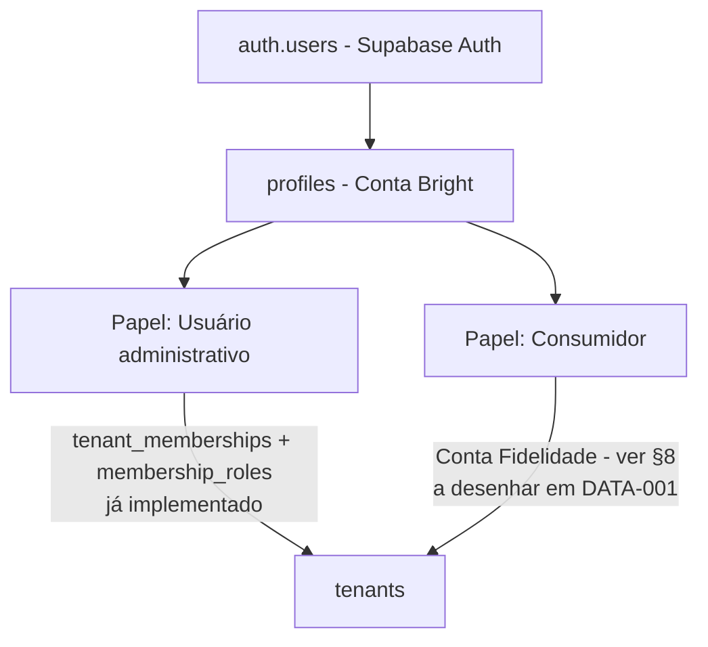
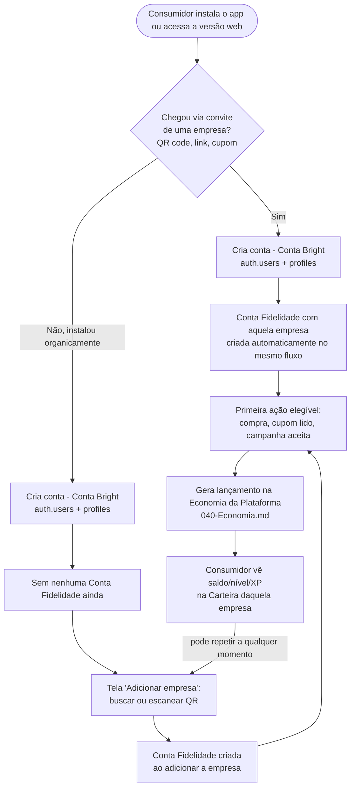
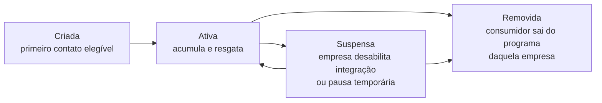

# IDENT-001 — Modelo de Identidade do Consumidor

**Status:** Aprovado pela Direção — congelado (mudanças futuras exigem ADR, ver §11)
**Versão:** 0.3.0 — formaliza a responsabilidade da Conta Fidelidade, adiciona a coluna "Administra" na Matriz Oficial de RLS (§7), nomeia o §6 como Fluxo Oficial do Consumidor v1, e adiciona o §11 (Congelamento Arquitetural)
**Documentos relacionados:** `ADR-002-Arquitetura-do-Ecossistema-Bright.md`, `ARCH-001-Arquitetura-Geral.md`, `BE-003-Arquitetura-de-Dados-e-Supabase.md`, `docs/decisions/ADR-001-Modelo-de-identidade-e-multiempresa.md`

---

## 1. Objetivo

Congelar o modelo oficial de identidade do consumidor final: quem ele é, como se relaciona com a empresa parceira, qual é a entidade central dessa relação, como se autentica, e o que muda na RLS de `profiles` para viabilizar a Retaguarda da Empresa enxergar seus próprios consumidores. Esta fase é conceitual — nenhuma migration, alteração de banco, RLS ou componente React é criado aqui. O desenho de colunas/esquema físico em detalhe fica para `DATA-001`.

## 2. Modelo de identidade

A decisão de `ADR-002` permanece o ponto de partida: **identidade única**, mesmo mecanismo de autenticação (`auth.users` do Supabase Auth → `profiles`, 1:1) para todos os papéis que uma pessoa pode assumir.



Um mesmo `profiles` pode assumir **mais de um papel ao mesmo tempo** — ex.: colaborador administrativo de uma empresa e, simultaneamente, consumidor do programa de fidelidade de outra (ou até da mesma). Isso é consequência natural da identidade única: não é uma exceção a tratar, é o modelo normal. Cada papel se expressa por um vínculo próprio (`tenant_memberships` para administrativo, Conta Fidelidade para consumidor) — nunca por uma segunda conta de login.

## 3. Tipos de usuário e seus vínculos

| | Usuário administrativo | Consumidor |
|---|---|---|
| **Vínculo com a empresa** | `tenant_memberships` (já implementado) | **Conta Fidelidade** (§8) — não é `tenant_memberships` (decisão de `ADR-002`) |
| **Papéis/permissões** | Sim — RBAC granular (`roles`/`membership_roles`/`permissions`) | Não — consumidor não tem papel/permissão, tem saldo/relacionamento |
| **Cardinalidade** | Um vínculo por empresa (único por `tenant_id`+`profile_id`, `BE-003 §2.3`) | N:N — o mesmo consumidor pode ter uma Conta Fidelidade em várias empresas parceiras |
| **Volume esperado** | Pequeno por empresa (colaboradores) | Potencialmente toda a base de clientes de cada empresa parceira — ordens de grandeza maior |
| **Seleção de "empresa ativa"** | Sim — cookie `active_tenant_id`, um de cada vez (`BE-005 §7`) | Não se aplica da mesma forma — ver §6 |
| **Onde opera** | Retaguarda da Empresa | Aplicativo do Consumidor |

## 4. Relacionamento consumidor × empresa parceira

- **Cardinalidade:** N:N. Um consumidor pode ter uma Conta Fidelidade com múltiplas empresas parceiras; uma empresa parceira tem muitas Contas Fidelidade (uma por consumidor).
- **Dado por Conta Fidelidade, não por consumidor:** saldo, cashback, pontos, nível, XP, ranking, tickets — tudo isso pertence **à Conta Fidelidade de um par específico (consumidor, empresa)**, nunca a uma soma global do consumidor. Duas empresas parceiras não compartilham saldo do mesmo consumidor nesta fase (expansão para múltiplas moedas entre empresas já registrada como "mudança de fundo, não incremental" em `docs/product/090-Roadmap.md §6` — fora de escopo agora).
- **Entidade central:** ver Capítulo 8.

## 5. Regras de vínculo (Conta Fidelidade)

- **Criação:** automática, no primeiro contato elegível (compra confirmada, aceite de convite, leitura de QR/cupom) — nunca exige aprovação manual da empresa.
- **Status:** reaproveita o mesmo vocabulário já usado em `tenant_memberships` (`active`/`suspended`/`removed`, `BE-003 §2.3`). `suspended` cobre, por exemplo, uma empresa que desabilita temporariamente a integração; `removed`, o consumidor que pede para sair do programa daquela empresa especificamente (as demais Contas Fidelidade dele, com outras empresas, não são afetadas).
- **Multiplicidade:** uma Conta Fidelidade por par (consumidor, empresa parceira) — mesma regra de unicidade já usada em `tenant_memberships`.
- **Sem papel/permissão:** a Conta Fidelidade nunca ganha entrada em `membership_roles` — não é RBAC, é relação comercial.

## 6. Fluxo Oficial do Consumidor v1

Fluxo único, **congelado** — as duas formas de entrada (convite vs. orgânica) convergem para o mesmo ponto. É a base para `UX-001`, `APP-001`, onboarding, OCR e campanhas. Qualquer alteração futura a este fluxo exige uma ADR (ver §11).



**Resolvendo as perguntas em aberto da primeira versão deste documento:**

- **"Escolhe empresa?"** — só se não veio de convite direto; quem chega organicamente escolhe/escaneia depois do cadastro.
- **"Empresa envia convite?"** — sim, é uma das duas portas de entrada (a outra é orgânica).
- **"Escaneia QR code?"** — sim, mecanismo tanto do convite inicial quanto de adicionar uma nova empresa depois, a qualquer momento.
- **"Lê cupom / já entra em campanha?"** — ambos são formas de "primeira ação elegível", que só existe depois de a Conta Fidelidade já ter sido criada.
- **"Recebe benefícios / entra na carteira?"** — consequência contínua, não uma etapa única — a Carteira é a visão permanente do estado da Conta Fidelidade.

**Login recorrente:** mesmo fluxo já existente (`auth.getUser()` no servidor, nunca `getSession()` — `BE-005 §10`), sem alteração.

**Sem "seleção de empresa ativa" no sentido do administrador:** o admin opera uma empresa de cada vez (cookie `active_tenant_id`, `BE-005 §7`); o consumidor tem saldo com várias ao mesmo tempo — a tela inicial mostra as Contas Fidelidade diretamente (agregadas ou por empresa, decisão de `UX-001`), nunca um seletor bloqueante como `/selecionar-empresa`.

**Roteamento quando a mesma pessoa é administrador e consumidor:** ao logar, se existir tanto `tenant_memberships` ativa quanto Conta Fidelidade ativa para o mesmo `profiles`, o sistema pergunta explicitamente qual experiência abrir ("entrar como administrador ou como consumidor") — decisão de UX a detalhar em `UX-001`, princípio já congelado aqui: nunca presumir uma das duas.

## 7. Matriz Oficial de RLS

**Congelada** — mudanças futuras exigem ADR (§11). Escopo de cada coluna: **Visualiza** = leitura; **Edita** = altera dado próprio/operacional (nunca saldo, que é sempre resultado de regra de negócio, nunca edição manual livre); **Administra** = habilita/desabilita, configura ou gerencia em nome de outros.

| Ator | Visualiza | Edita | Administra |
|---|---|---|---|
| Consumidor (próprio) | Próprio `profiles` completo + todas as próprias Contas Fidelidade (todas as empresas) | Próprio `profiles` (dados de perfil — nome de exibição, avatar) | Não administra — não há saldo/nível editável manualmente por ninguém, é sempre resultado de regra de negócio (`040-Economia.md`) |
| Consumidor sobre outro consumidor | Nada | Nada | Nada |
| Colaborador administrativo (própria empresa) | Nome/e-mail + Conta Fidelidade (saldo, nível, histórico resumido) de consumidores vinculados à própria empresa — requer permissão `tenant.consumers.view` (nova, catálogo a estender em `DATA-001`) | Dados operacionais da Conta Fidelidade (ex.: status — suspender/reativar) — requer permissão `tenant.consumers.manage` (nova); nunca edita saldo/nível diretamente | Habilita/desabilita módulos de fidelidade contratados e gerencia campanhas da própria empresa — requer permissão de administração já prevista no catálogo (`BE-006`) |
| Colaborador administrativo (própria empresa) sobre **outro colaborador** da mesma empresa | **Ainda não resolvido** — pendência antiga (`CORE-001 §10`), é RLS entre administradores, não é escopo de Conta Fidelidade | — | — |
| Colaborador administrativo sobre consumidor/Conta Fidelidade de **outra empresa** | Nada | Nada | Nada — isolamento por tenant, mesmo princípio de todo o RLS existente (`BE-003 §5`) |
| `platform.admin` (staff Bright) | Qualquer `profiles`/Conta Fidelidade, cross-tenant | Qualquer dado, via ferramentas internas | Administra a plataforma inteira — mesmo padrão já concedido hoje (15/15 permissões, `PERM-001`) |

**Implementação recomendada (mantida da v0.2.0):** dado de exibição mínimo (nome, e-mail) duplicado na própria Conta Fidelidade no momento da criação/atualização — evita abrir uma política ampla de leitura cross-user em `profiles`. Uma view/função `SECURITY DEFINER` fica reservada para necessidade futura de dado mais completo (ex.: suporte investigando disputa). Esquema exato e as permissões `tenant.consumers.view`/`tenant.consumers.manage` são trabalho de `DATA-001`; a regra de acesso (linha por linha da tabela acima) já está congelada aqui.

## 8. Modelo Oficial da Conta Fidelidade

### 8.1 Entidade central

O nome oficial da entidade que representa a relação entre um consumidor e uma empresa parceira é **Conta Fidelidade**.

**Por que não as outras opções:**
- *ConsumidorEmpresa* — descreve a tabela de junção (join), não o conceito de negócio; é nome de implementação, não de produto.
- *Participação* — sugere vínculo pontual a uma campanha específica, não a relação contínua e central que guarda saldo/nível/histórico.
- *Carteira* — é a **visão** do consumidor sobre a Conta Fidelidade (a tela `/cliente/carteira`), não a entidade em si. Uma pessoa pode ter várias Carteiras visíveis no app (uma por empresa), cada uma exibindo os dados de uma Conta Fidelidade diferente.

### 8.2 Proprietário

A Conta Fidelidade **não pertence exclusivamente a nenhum dos dois lados** — é uma entidade de relacionamento, mesmo padrão já usado por `tenant_memberships` (que também não pertence só ao `profiles` nem só ao `tenant`). Tecnicamente, vive no Core da Plataforma (mesma camada de `tenant_memberships`), não na Retaguarda nem no Aplicativo isoladamente — ambos a consomem. Do ponto de vista de negócio, consumidor e empresa parceira têm interesse e visibilidade legítimos e parciais sobre ela — exatamente o que a matriz do §7 define linha a linha.

### 8.3 Relacionamento

Um consumidor tem **uma Conta Fidelidade por empresa parceira** (N:N entre consumidor e empresa, mediado por uma Conta Fidelidade por par — mesma forma de `tenant_memberships`, adaptada ao novo contexto). Nenhuma Conta Fidelidade é compartilhada entre duas empresas.

### 8.4 Responsabilidades

A Conta Fidelidade é o ponto de encontro entre os dois lados da relação — nenhum dado de fidelidade vive fora dela:

```text
Consumidor
        │
        ▼
Conta Fidelidade
        ▲
        │
Empresa
```

**Toda evolução da fidelidade acontece dentro da Conta Fidelidade.** Ela concentra:

- Guarda o **estado agregado corrente**: saldo de cashback, saldo de pontos, nível, XP, posição no ranking daquela empresa, benefícios disponíveis, campanhas ativas, status (`active`/`suspended`/`removed`).
- **Não guarda o histórico linha a linha** — cada movimentação (ganho, resgate, expiração, estorno) é um lançamento separado no livro-razão da Economia da Plataforma (`040-Economia.md §3`), que referencia a Conta Fidelidade à qual pertence. A Conta Fidelidade é o "saldo atual", não o extrato completo.
- É a entidade que o Motor de Benefícios (`060-IA.md §5`) lê e atualiza a cada evento elegível.
- É a entidade que a Retaguarda (módulo Clientes) lista e consulta, respeitando a matriz do §7.
- **Não guarda regra de negócio da mecânica** (percentual de cashback, fórmula de XP, tabela de probabilidade de roleta) — isso continua em `040-Economia.md`/`050-Gamificacao.md`. A Conta Fidelidade é o estado; a regra vive nos documentos de produto.

### 8.5 Ciclo de vida



Nunca é excluída fisicamente (soft state, mesmo princípio de `BE-002 §11` — soft delete quando há justificativa; aqui a justificativa é clara: histórico financeiro nunca pode simplesmente desaparecer, tanto para auditoria quanto para disputa do consumidor). `Removida` encerra a relação, mas os lançamentos já registrados no livro-razão permanecem, para fins de auditoria — a Conta Fidelidade não volta a acumular novos lançamentos nesse estado.

## 9. Consistência com a ADR-002

- [x] Identidade única mantida — nenhum mecanismo de autenticação paralelo proposto.
- [x] Consumidor não usa `tenant_memberships` como vínculo final — usa Conta Fidelidade (§8).
- [x] Nenhuma referência a produtos fora de escopo.
- [x] Nenhuma tabela, coluna ou política criada — apenas modelo conceitual, matriz de acesso e fluxo, todos para decisão/implementação futura.

## 10. Fronteira com a DATA-001

Fica para `DATA-001`: nome final das colunas da Conta Fidelidade, o esquema do livro-razão de lançamentos (que referencia a Conta Fidelidade), e a implementação técnica escolhida para a visibilidade do §7 (view/RPC vs. dado duplicado). Esta fase entrega a **entidade central, seu ciclo de vida, o relacionamento e as regras de acesso** — não o **esquema físico**.

## 11. Congelamento Arquitetural

Ao final desta fase, os itens abaixo estão **congelados**:

- Identidade única (§2).
- Conta Fidelidade — nome, proprietário, relacionamento, responsabilidades, ciclo de vida (§8).
- Relacionamento N:N consumidor × empresa parceira (§4).
- Fluxo Oficial do Consumidor v1 (§6).
- Matriz Oficial de RLS (§7).

**Estes itens não podem mais ser alterados diretamente em `DATA-001`, `UX-001` ou qualquer fase seguinte.** Qualquer mudança futura a eles exige uma decisão arquitetural documentada (ADR), no mesmo padrão de `ADR-001`/`ADR-002` — nunca um ajuste silencioso dentro de outra fase.

## 12. Pendências e decisões da Direção

1. Confirmar se o cadastro do consumidor terá métodos de autenticação além de e-mail/senha (não presumido — mantido como está hoje no Core).
2. **Pendência antiga, ainda não resolvida por esta fase:** visibilidade entre colaboradores administrativos da mesma empresa (`CORE-001 §10`) — não é Conta Fidelidade, é RLS de `profiles` entre administradores; registrada aqui para não ser esquecida, mas não bloqueia `DATA-001`.
3. As permissões `tenant.consumers.view`/`tenant.consumers.manage` (§7) são propostas de nome — catálogo formal e migration ficam para `DATA-001`.
