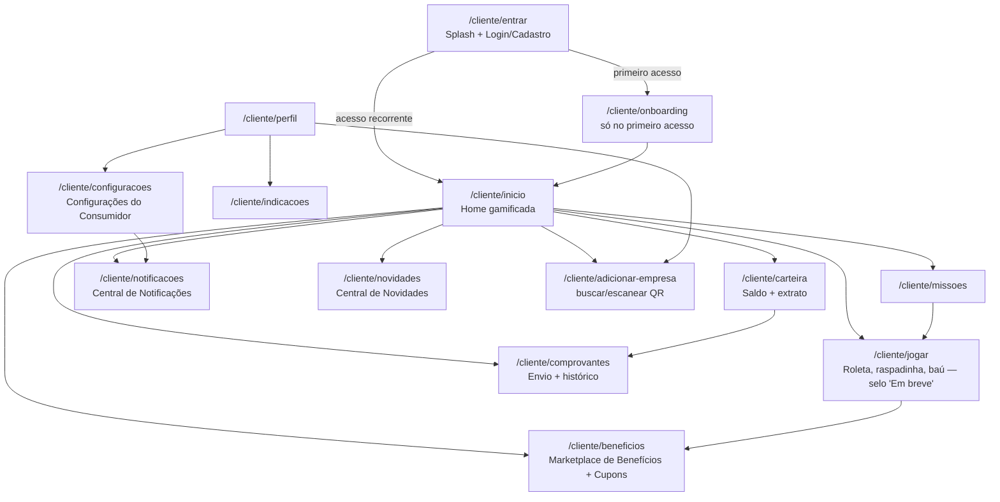
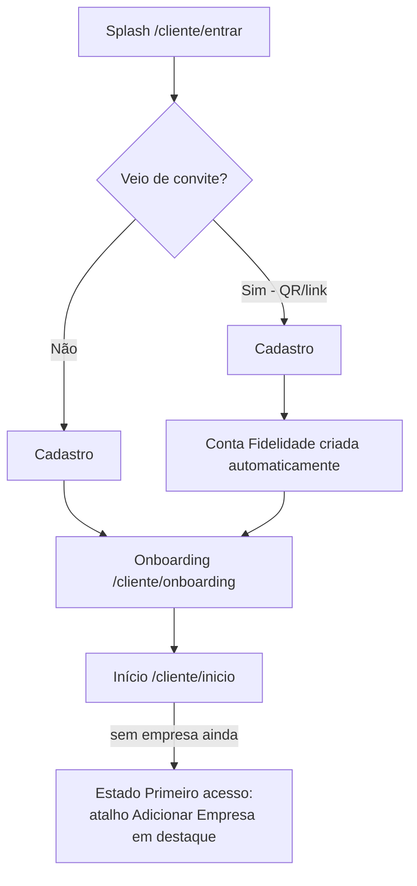
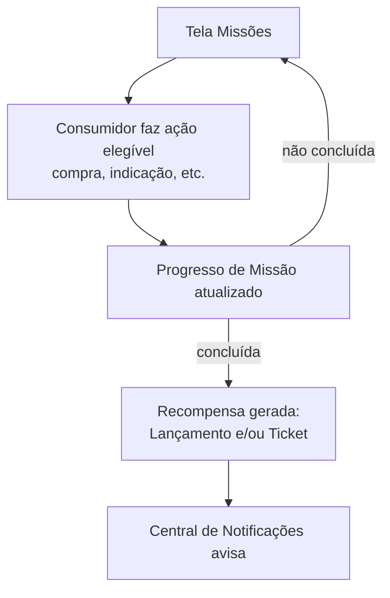
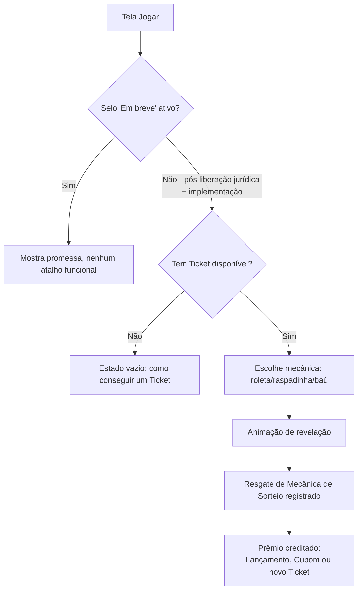
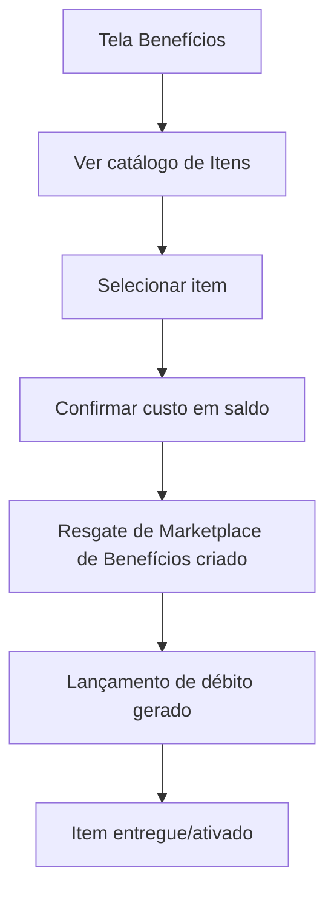
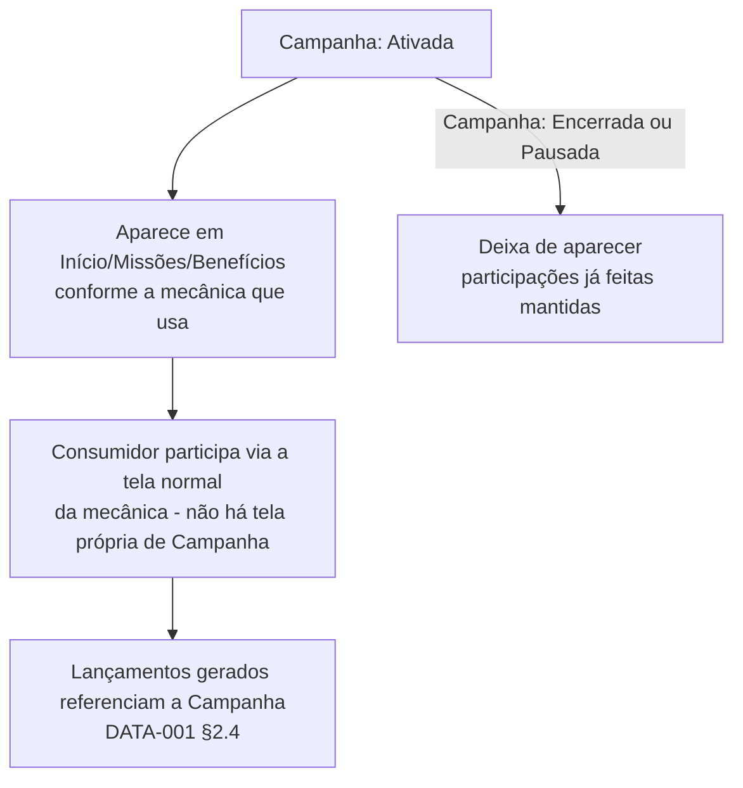

# UX-001 — Arquitetura da Experiência do Consumidor

**Status:** Aprovado pela Direção
**Versão:** 0.2.0 — adiciona o Princípio de UX Emocional (§2), a tela Configurações do Consumidor (§5.11), separa Notificações em Central de Notificações e Central de Novidades (§11), acrescenta o estado "Primeiro acesso" em todas as telas e o selo "Em breve" na tela Jogar
**Documentos relacionados:** `IDENT-001-Modelo-de-Identidade.md` (Fluxo Oficial do Consumidor v1, Conta Fidelidade), `DATA-001-Modelo-Conceitual-de-Dados.md` (entidades, eventos), `ARCH-001-Arquitetura-Geral.md`

---

## 1. Objetivo

Definir a arquitetura de experiência do Aplicativo do Consumidor — navegação, wireframes, estados de tela, comportamento de componentes e regras de interação — sobre o modelo de entidades já congelado em `DATA-001`, antes de qualquer linha de React ser escrita. Esta fase é de design: nenhum componente, código ou alteração de banco é criado aqui. `DS-001` (próxima fase) traduz estas decisões em tokens visuais e componentes reutilizáveis; `APP-001` as implementa.

## 2. Princípio de UX Emocional

O aplicativo **não pode transmitir sensação de sistema de fidelidade tradicional** (cartão de papel furado, extrato burocrático). Ele precisa despertar curiosidade e vontade de retornar — mesmo espírito já registrado no Manifesto (`010-Manifesto.md`), agora formalizado como princípio de UX obrigatório.

**Toda tela principal deve responder a pelo menos uma destas perguntas:**

1. O que eu ganho hoje?
2. O que falta para subir de nível?
3. Qual missão posso concluir?
4. Tenho alguma recompensa esperando?
5. Vale a pena voltar amanhã?

Cada wireframe do §5 indica explicitamente qual(is) pergunta(s) responde. Telas puramente utilitárias (Perfil, Configurações, Adicionar Empresa) são a exceção deliberada — servem à gestão da conta, não à progressão, e não precisam responder a nenhuma das cinco.

## 3. Mapa de Navegação Completo



### Navegação principal (barra inferior)

**Início · Carteira · Jogar · Benefícios · Perfil** — cinco itens, **fixos em praticamente todas as telas do aplicativo** (decisão definitiva da Direção). Missões, Comprovantes, Indicações, Configurações, Notificações e Novidades são acessados a partir dessas cinco raízes, para não sobrecarregar a barra principal.

### Telas mínimas (12)

1. Entrada e apresentação (`/cliente/entrar`)
2. Onboarding (`/cliente/onboarding`)
3. Início gamificado (`/cliente/inicio`)
4. Carteira (`/cliente/carteira`)
5. Missões (`/cliente/missoes`)
6. Jogar — central de jogos e recompensas (`/cliente/jogar`)
7. Benefícios (`/cliente/beneficios`)
8. Envio de comprovante (`/cliente/comprovantes`)
9. Indicação (`/cliente/indicacoes`)
10. Perfil (`/cliente/perfil`)
11. **Configurações do Consumidor** (`/cliente/configuracoes`) — nova nesta versão
12. Adicionar empresa (`/cliente/adicionar-empresa`)

(Central de Notificações e Central de Novidades detalhadas no §11 — são destinos de navegação, não contam como "telas principais" para efeito desta lista, mesmo padrão de Comprovantes/Indicações.)

## 4. Seleção de contexto (múltiplas Contas Fidelidade)

`IDENT-001 §6` já congelou que o consumidor **não** usa um seletor bloqueante como o administrador (`/selecionar-empresa`). Mas como uma Conta Fidelidade é sempre por par (consumidor, empresa) — `DATA-001 §2.1` —, toda tela cujo conteúdo é específico de uma empresa (Carteira, Missões, Jogar, Benefícios) precisa saber **qual** Conta Fidelidade mostrar quando o consumidor tem mais de uma.

**Regra desta fase:** um seletor de contexto **não bloqueante**, sempre visível no topo dessas quatro telas (nome da empresa + ícone de troca), nunca uma tela própria de seleção. A tela Início mostra um **resumo agregado** de todas as Contas Fidelidade (um cartão por empresa), não força escolha prévia.

## 5. Wireframes e fluxo por tela

Cada tela segue o mesmo roteiro: pergunta-guia (§2), objetivo, componentes, ações, estados (incluindo **Primeiro acesso**, distinto de vazio comum), navegação, regras.

### 5.1 Entrada e apresentação — `/cliente/entrar`

```text
┌─────────────────────────────────┐
│                                  │
│         Bright                  │
│   (logo + tagline curta)        │
│                                  │
│  [ Entrar ]                     │
│  [ Criar conta ]                │
│                                  │
│  Veio de um convite? Escaneie   │
│  o QR code da sua empresa       │
│  [ Escanear QR ]                │
└─────────────────────────────────┘
```

- **Pergunta-guia:** nenhuma das cinco — é a porta de entrada, estabelece a promessa antes de qualquer dado existir.
- **Objetivo:** primeiro contato — transmitir descoberta, não burocracia.
- **Componentes:** logo, botão Entrar, botão Criar conta, atalho de escaneamento de QR.
- **Ações:** entrar, criar conta, escanear QR.
- **Estados:** padrão; carregando; erro de credencial (mensagem genérica).
- **Navegação:** → Onboarding (primeiro acesso) ou → Início (login recorrente).
- **Regras:** nunca expõe se um e-mail existe ou não.

### 5.2 Onboarding — `/cliente/onboarding`

```text
┌─────────────────────────────────┐
│  Bem-vindo! Veja o que você     │
│  pode fazer aqui:                │
│                                  │
│  🎯 Ganhe pontos e cashback     │
│  🎁 Jogue e ganhe prêmios       │
│  👥 Indique amigos              │
│                                  │
│         [ Começar ]             │
└─────────────────────────────────┘
```

- **Pergunta-guia:** prepara terreno para "vale a pena voltar amanhã?" — é a primeira promessa do produto.
- **Objetivo:** apresentar o valor do app antes da primeira tela funcional — só aparece uma vez.
- **Componentes:** carrossel de 2–3 cartões, botão de avançar/pular.
- **Ações:** avançar, pular.
- **Estados:** único (conteúdo estático) — este é, em si, o estado "Primeiro acesso" do app como um todo.
- **Navegação:** → Início.
- **Regras:** nunca reaparece em logins seguintes.

### 5.3 Início gamificado — `/cliente/inicio`

```text
┌─────────────────────────────────┐
│ Olá, Renan                      │
│ Nível 4 · 1.280 XP              │
├─────────────────────────────────┤
│ CORE-001 Teste A                │
│ R$ 18,50 cashback · 2.450 pontos│
├─────────────────────────────────┤
│ 🎁 Você tem 3 novidades         │
│ [ Girar roleta ] [ Abrir baú ]  │
│ [ Enviar comprovante ]          │
├─────────────────────────────────┤
│ Missões de hoje                 │
│ ▓▓▓▓▓▓░░ 2 de 3 concluídas      │
├─────────────────────────────────┤
│ Início  Carteira  Jogar  Perfil │
└─────────────────────────────────┘
```

- **Pergunta-guia:** "O que eu ganho hoje?" e "Tenho alguma recompensa esperando?"
- **Objetivo:** transmitir progressão e descoberta — porta de entrada gamificada, nunca painel administrativo.
- **Componentes:** cabeçalho (nome, nível, XP), cartão de resumo por empresa, atalhos de ação, barra de progresso de missões do dia.
- **Ações:** girar roleta/abrir baú (→ Jogar), enviar comprovante (→ Comprovantes), ver missão (→ Missões), trocar contexto (§4).
- **Estados:**
  - Carregando.
  - **Primeiro acesso** (nenhuma Conta Fidelidade ainda — consumidor cadastrado organicamente): "Você ainda não está em nenhuma empresa. Adicione uma para começar a ganhar." + atalho para Adicionar Empresa, em destaque.
  - Vazio parcial (tem Conta Fidelidade, mas sem Ticket/missão do dia): a seção correspondente some, nunca aparece com "0 de 0".
- **Navegação:** raiz da barra inferior.
- **Regras:** nunca mostra dado fictício/zerado como se fosse real.

### 5.4 Carteira — `/cliente/carteira`

```text
┌─────────────────────────────────┐
│ [Empresa ▾]  Carteira           │
├─────────────────────────────────┤
│ R$ 18,50 cashback               │
│ 2.450 pontos                    │
│ Nível 4 · 1.280 / 1.500 XP      │
├─────────────────────────────────┤
│ Extrato                         │
│ + R$ 5,00 cashback  · Compra    │
│ + 100 pontos · Missão concluída │
│ - 200 pontos · Cupom resgatado  │
├─────────────────────────────────┤
│ Início  Carteira  Jogar  Perfil │
└─────────────────────────────────┘
```

- **Pergunta-guia:** "Vale a pena voltar amanhã?" — a transparência do extrato é o que sustenta a confiança para o consumidor continuar usando.
- **Objetivo:** transparência total do saldo — princípio inegociável do Manifesto.
- **Componentes:** seletor de contexto (§4), cartão de saldo, lista de extrato (Lançamentos).
- **Ações:** trocar empresa, abrir detalhe de um lançamento.
- **Estados:**
  - Carregando.
  - **Primeiro acesso** (Conta Fidelidade recém-criada, nenhum Lançamento ainda): "Sua carteira está pronta. Faça sua primeira compra e veja o saldo aparecer aqui."
  - Vazio comum (teve movimentação antes, mas nada no período filtrado, se houver filtro): "Nenhuma movimentação neste período."
- **Navegação:** item da barra inferior.
- **Regras:** todo Lançamento exibido mostra origem e, se aplicável, validade.

### 5.5 Missões — `/cliente/missoes`

```text
┌─────────────────────────────────┐
│ [Empresa ▾]  Missões            │
├─────────────────────────────────┤
│ Compre 3 vezes este mês         │
│ ▓▓▓▓▓▓░░ 2 de 3                 │
│ Recompensa: 100 pontos          │
├─────────────────────────────────┤
│ Indique um amigo                │
│ ▓▓▓▓▓▓▓▓ Concluída ✓            │
├─────────────────────────────────┤
│ Início  Carteira  Jogar  Perfil │
└─────────────────────────────────┘
```

- **Pergunta-guia:** "Qual missão posso concluir?" e "O que falta para subir de nível?"
- **Objetivo:** engajamento com critério visível antes de participar.
- **Componentes:** lista de Missões com Progresso de Missão, barra de progresso, recompensa.
- **Ações:** abrir detalhe de uma missão.
- **Estados:**
  - Carregando.
  - **Primeiro acesso** (nenhuma missão jamais vista): "Suas primeiras missões aparecerão aqui em breve."
  - Vazio comum (já teve missões, mas nenhuma ativa agora): "Nenhuma missão disponível no momento."
- **Navegação:** acessível a partir de Início.
- **Regras:** regra da missão sempre visível antes de participar.

### 5.6 Jogar — central de jogos e recompensas — `/cliente/jogar`

```text
┌─────────────────────────────────┐
│ [Empresa ▾]  Jogar   [Em breve] │
├─────────────────────────────────┤
│ Você tem 2 tickets               │
│                                  │
│  [ 🎰 Roleta ]  [ 🎟️ Raspadinha ]│
│  [ 🎁 Baú ]                      │
├─────────────────────────────────┤
│ Início  Carteira  Jogar  Perfil │
└─────────────────────────────────┘
```

- **Pergunta-guia:** "Tenho alguma recompensa esperando?"
- **Objetivo:** experiência interativa e gamificada, **sem depender de aposta financeira entre usuários**.
- **Selo obrigatório:** **"Em breve"** (ou "Disponível em breve") exibido permanentemente no cabeçalho da tela enquanto não houver liberação jurídica (`080-Seguranca.md §4`) **e** implementação técnica — decisão da Direção, não apenas nota de rodapé. O selo é removido somente quando as duas condições estiverem satisfeitas.
- **Componentes:** selo "Em breve", contador de Tickets disponíveis, atalhos por tipo de mecânica.
- **Ações:** jogar uma mecânica (gera um Resgate de Mecânica de Sorteio) — desabilitado enquanto o selo estiver ativo.
- **Estados:**
  - **Primeiro acesso**/bloqueado por selo: tela mostra a promessa ("Em breve você vai poder jogar e ganhar prêmios aqui") sem nenhum atalho funcional.
  - Sem Ticket (pós-liberação): estado vazio explicando como conseguir um.
  - Carregando durante o sorteio; resultado.
- **Navegação:** item da barra inferior.
- **Regras:** nunca remove o selo antecipadamente, mesmo que a implementação técnica esteja pronta, sem a liberação jurídica correspondente.

### 5.7 Benefícios — `/cliente/beneficios`

```text
┌─────────────────────────────────┐
│ [Empresa ▾]  Benefícios          │
├─────────────────────────────────┤
│ Meus cupons                     │
│ 10% na próxima compra           │
│ [ Usar ]                        │
├─────────────────────────────────┤
│ Marketplace de Benefícios       │
│ Troque pontos por vantagens     │
│ [ Ver catálogo ]                │
├─────────────────────────────────┤
│ Início  Carteira  Jogar  Perfil │
└─────────────────────────────────┘
```

- **Pergunta-guia:** "O que eu ganho hoje?"
- **Objetivo:** reunir Cupons próprios e o Marketplace de Benefícios em um só lugar.
- **Componentes:** lista de Cupons disponíveis, atalho para o catálogo do Marketplace de Benefícios.
- **Ações:** usar cupom, trocar item do Marketplace de Benefícios.
- **Estados:**
  - Carregando.
  - **Primeiro acesso** (nunca teve cupom nem viu o marketplace): "Seus cupons e benefícios vão aparecer aqui assim que você começar a ganhar."
  - Vazio comum por seção (independente uma da outra).
- **Navegação:** item da barra inferior.
- **Regras:** troca no Marketplace de Benefícios sempre confirma o custo antes de debitar.

### 5.8 Envio de comprovante — `/cliente/comprovantes`

```text
┌─────────────────────────────────┐
│ [Empresa ▾]  Comprovantes        │
├─────────────────────────────────┤
│ [ 📷 Enviar novo comprovante ]  │
├─────────────────────────────────┤
│ Histórico                        │
│ 28/07 · Processado · +R$ 5,00   │
│ 25/07 · Em análise              │
│ 20/07 · Rejeitado                │
├─────────────────────────────────┤
│ Início  Carteira  Jogar  Perfil │
└─────────────────────────────────┘
```

- **Pergunta-guia:** "O que eu ganho hoje?" (ao enviar, antecipa o cashback/pontos a caminho).
- **Objetivo:** alternativa manual quando não há integração direta de ponto de venda.
- **Componentes:** atalho de captura/upload, lista de Comprovantes com status.
- **Ações:** enviar novo, ver detalhe.
- **Estados:**
  - Enviando; processando; processado; rejeitado (com motivo).
  - **Primeiro acesso** (nunca enviou nenhum): "Você ainda não enviou nenhum comprovante. Envie o primeiro e comece a acumular pontos."
- **Navegação:** acessível a partir de Início e da Carteira.
- **Regras:** nunca gera saldo disponível antes da confirmação.

### 5.9 Indicação — `/cliente/indicacoes`

```text
┌─────────────────────────────────┐
│  Indicações                     │
├─────────────────────────────────┤
│ Convide amigos e ganhe recompensa│
│ [ Compartilhar link ]           │
├─────────────────────────────────┤
│ Suas indicações                 │
│ João · Aceita ✓                 │
│ Maria · Aguardando              │
├─────────────────────────────────┤
│ Início  Carteira  Jogar  Perfil │
└─────────────────────────────────┘
```

- **Pergunta-guia:** "Tenho alguma recompensa esperando?" (a recompensa de indicação).
- **Objetivo:** mecânica de indicação.
- **Componentes:** atalho de compartilhamento, lista de Indicações com status.
- **Ações:** compartilhar.
- **Estados:**
  - **Primeiro acesso**: "Convide seus amigos e ganhe recompensas quando eles entrarem."
  - Vazio comum é o mesmo texto — indicação não tem um segundo estado vazio distinto do primeiro acesso, já que a tela é sempre sobre "o que falta fazer".
- **Navegação:** acessível a partir do Perfil.
- **Regras:** recompensa só é gerada quando a Indicação muda para "Aceita".

### 5.10 Perfil — `/cliente/perfil`

```text
┌─────────────────────────────────┐
│  👤 Renan                       │
│  renan@exemplo.com              │
├─────────────────────────────────┤
│ Minhas empresas                 │
│ • Empresa A                     │
│ • Empresa B                     │
│ [ Adicionar empresa ]           │
├─────────────────────────────────┤
│ Indicações                      │
│ Configurações                   │
│ Sair                            │
├─────────────────────────────────┤
│ Início  Carteira  Jogar  Perfil │
└─────────────────────────────────┘
```

- **Pergunta-guia:** nenhuma das cinco — tela utilitária (§2).
- **Objetivo:** gestão da própria Conta Bright.
- **Componentes:** dados do `profiles`, lista de empresas com Conta Fidelidade ativa, atalhos para Adicionar Empresa, Indicações, Configurações, Sair.
- **Ações:** editar dados de perfil, adicionar empresa, sair.
- **Estados:** padrão; carregando ao salvar edição — sem estado "Primeiro acesso" próprio (sempre há ao menos o próprio perfil preenchido).
- **Navegação:** item da barra inferior.
- **Regras:** edição sempre self-only.

### 5.11 Configurações do Consumidor — `/cliente/configuracoes`

```text
┌─────────────────────────────────┐
│  Configurações                  │
├─────────────────────────────────┤
│ Notificações                    │
│  Missões concluídas      [ ● ] │
│  Cashback liberado       [ ● ] │
│  Campanhas               [ ○ ] │
├─────────────────────────────────┤
│ Novidades                       │
│  Receber novidades       [ ● ] │
├─────────────────────────────────┤
│ Privacidade                     │
│  Meus dados (LGPD)              │
└─────────────────────────────────┘
```

- **Pergunta-guia:** nenhuma das cinco — tela utilitária, nova nesta versão.
- **Objetivo:** dar ao consumidor controle sobre o que recebe (Central de Notificações vs. Central de Novidades, §11) e acesso aos próprios dados (LGPD).
- **Componentes:** lista de preferências de notificação por tipo (liga/desliga), preferência de novidades, atalho para dados pessoais (ver/exportar/solicitar exclusão — mesmo princípio de `080-Seguranca.md §2`).
- **Ações:** ativar/desativar cada tipo de notificação, acessar dados pessoais.
- **Estados:** padrão; carregando ao salvar.
- **Navegação:** acessível a partir do Perfil.
- **Regras:** desativar uma categoria de notificação nunca desativa o evento em si (o Lançamento/Missão/etc. continua acontecendo — só a notificação correspondente deixa de ser enviada).

### 5.12 Adicionar empresa — `/cliente/adicionar-empresa`

- **Pergunta-guia:** nenhuma das cinco — tela utilitária.
- **Objetivo:** criar uma nova Conta Fidelidade a qualquer momento, sem precisar de novo cadastro.
- **Componentes:** busca por nome, atalho de escaneamento de QR.
- **Ações:** buscar, escanear, confirmar adesão.
- **Estados:** carregando; erro (empresa não encontrada ou já vinculada).
- **Navegação:** acessível a partir de Início e Perfil.

## 6. Fluxo Oficial de Onboarding

Detalha, em nível de UX, o Fluxo Oficial do Consumidor v1 já congelado em `IDENT-001 §6`:



## 7. Fluxo de Envio de Comprovantes

```mermaid
graph TD
    A[Carteira ou Início] --> B[/cliente/comprovantes]
    B --> C[Capturar/selecionar imagem]
    C --> D[Upload]
    D --> E[Comprovante: Enviado]
    E --> F[OCR processa]
    F -->|Aprovado| G[Comprovante: Processado<br/>Lançamento Pendente criado]
    F -->|Rejeitado| H[Comprovante: Rejeitado<br/>motivo exibido]
    G --> I[Lançamento segue seu próprio ciclo<br/>040-Economia.md §3]
```

## 8. Fluxo de Missões



## 9. Fluxo de Gamificação (Jogar)



## 10. Fluxo do Marketplace de Benefícios



## 11. Fluxo de Notificações e Novidades

`DATA-001` não modelou uma entidade própria de notificação — esta fase não cria uma agora (fora do escopo de UX-001, que não altera o modelo de dados). O que muda nesta versão é a **separação funcional em dois conceitos de UX distintos**, ambos derivados de eventos já existentes ou de conteúdo institucional — nunca misturados na mesma lista:

### 11.1 Central de Notificações — `/cliente/notificacoes`

Mensagens **operacionais**, derivadas diretamente de Eventos já catalogados em `DATA-001 §8`:

| Evento (origem em `DATA-001 §8`) | Notificação |
|---|---|
| Progresso de Missão → Concluído | "Missão concluída! Você ganhou [recompensa]." |
| Lançamento → Disponibilizado | "Você recebeu [valor] de cashback/pontos." |
| Ticket → Gerado | "Você ganhou um ticket! Vá jogar." |
| Indicação → Aceita | "Sua indicação [nome] entrou — recompensa creditada." |
| Comprovante → Rejeitado | "Seu comprovante não foi aprovado: [motivo]." |
| Campanha → Ativada (da empresa do consumidor) | "Nova campanha disponível: [nome]." |
| — (lembrete, sem evento de origem em `DATA-001`) | Lembretes de reengajamento (ex.: "Você tem um ticket parado há 3 dias") — comportamental, agendado, não gerado por um Evento específico |
| — (institucional) | Avisos da empresa parceira (ex.: horário especial, manutenção) — conteúdo livre da Retaguarda, não um Evento de entidade |

### 11.2 Central de Novidades — `/cliente/novidades`

Conteúdo **promocional/editorial**, nunca misturado com a Central de Notificações: promoções, eventos, novidades de produto, conteúdos, atualizações do aplicativo. Não deriva de Eventos de entidade — é conteúdo publicado pela Bright ou pela empresa parceira, análogo a um mural.

**Regra de separação:** uma mensagem é sempre uma OU outra, nunca as duas — o critério é "isso é sobre o que aconteceu com a minha Conta Fidelidade" (Notificações) vs. "isso é uma novidade que a empresa/Bright quer me contar" (Novidades).

**Pendência registrada:** se qualquer uma das duas centrais precisar de preferências por tipo (já modeladas em `/cliente/configuracoes`, §5.11) ou de histórico persistente além do que já existe nos eventos de origem, isso exige uma entidade própria — decisão para uma futura extensão de `DATA-001`, não desta fase.

## 12. Fluxo de Campanhas (visão do consumidor)



Decisão de UX: **não existe uma tela própria de "Campanhas"** — uma campanha se manifesta dentro das telas já existentes.

## 13. Consistência com IDENT-001, DATA-001 e ADR-002

- [x] Nenhum componente React, código ou banco alterado.
- [x] Todas as telas usam exclusivamente entidades já catalogadas em `DATA-001` (Notificações/Novidades explicitamente marcadas como não-entidade).
- [x] Seleção de contexto de empresa não bloqueante, conforme `IDENT-001 §6`.
- [x] "Marketplace de Benefícios" usado por extenso em toda a documentação.
- [x] Tela Jogar registra a dependência regulatória já existente e o selo "Em breve" obrigatório enquanto ela não for satisfeita.

## 14. Fronteira com DS-001

Fica para `DS-001`: identidade visual, paleta de cores, tipografia, ícones, grid, espaçamentos, animações, sombras, bordas, biblioteca de componentes visuais reutilizáveis, estados visuais e acessibilidade que implementam os wireframes desta fase. Esta fase entrega a **estrutura e o comportamento**, não a **aparência**.

## 15. Pendências e decisões da Direção

1. Confirmar o mapa de navegação e as 12 telas como completos.
2. Central de Notificações e Central de Novidades — confirmar se ficam apenas comportamentais (§11) ou exigem entidade própria (extensão futura de `DATA-001`), especialmente para lembretes e avisos institucionais que não têm Evento de origem em `DATA-001`.
3. Tela Jogar segue com o selo "Em breve" até liberação jurídica **e** implementação técnica — nenhuma mudança, apenas reafirmado com a regra de selo.
4. Confirmar a regra de seleção de contexto não bloqueante (§4) como definitiva.
